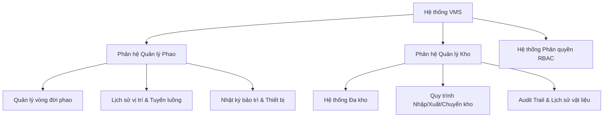
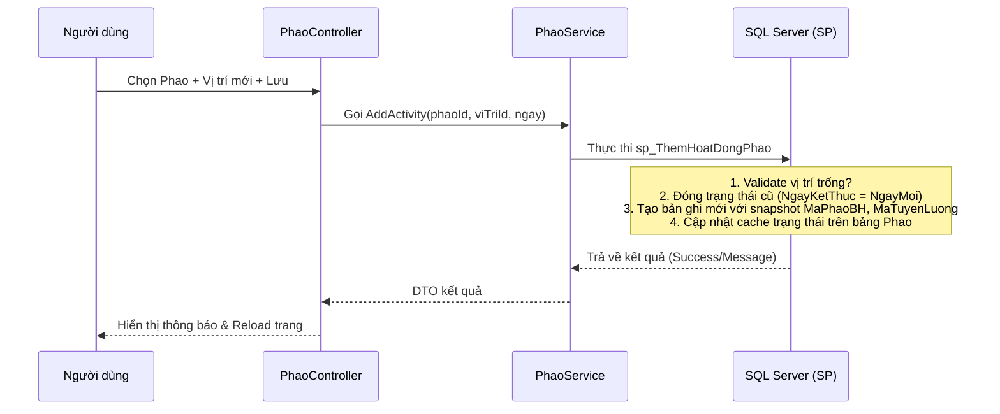
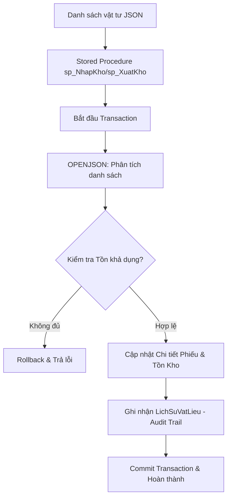

# 🚢 HỆ THỐNG QUẢN LÝ VÒNG ĐỜI PHAO BÁO HIỆU & KHO VẬT LIỆU (AAVMS - VMS PROJECT)

Chào mừng bạn đến với tài liệu kỹ thuật chi tiết của dự án **AAVMS (Vessel Management System)**. Đây là một giải pháp chuyển đổi số toàn diện được xây dựng dành cho việc quản lý vòng đời phao báo hiệu hàng hải và tối ưu hóa chuỗi cung ứng vật liệu bảo dưỡng.

Dự án được xây dựng dựa trên kiến trúc **Clean Architecture** kết hợp mô hình **ASP.NET Core MVC** trên nền tảng .NET và hệ quản trị cơ sở dữ liệu **SQL Server**.

---

## 📋 MỤC LỤC

1. [Tổng Quan Hệ Thống](#1-tổng-quan-hệ-thống)
2. [Kiến Trúc Kỹ Thuật (Architecture & Tech Stack)](#2-kiến-trúc-kỹ-thuật-architecture--tech-stack)
3. [Phân Hệ Quản Lý Phao (Buoy Module)](#3-phân-hệ-quản-lý-phao-buoy-module)
4. [Phân Hệ Quản Lý Kho Vật Liệu (Warehouse Module)](#4-phân-hệ-quản-lý-kho-vật-liệu-warehouse-module)
5. [Hệ Thống Phân Quyền & Bảo Mật (RBAC & Authentication)](#5-hệ-thống-phân-quyền--bảo-mật-rbac--authentication)
6. [Thiết Kế UI/UX Hệ Thống](#6-thiết-kế-uiux-hệ-thống)
7. [Cơ Cấu Thư Mục Dự Án](#7-cơ-cấu-thư-mục-dự-án)
8. [Hướng Dẫn Cấu Hình & Khởi Chạy](#8-hướng-dẫn-cấu-hình--khởi-chạy)

---

## 1. TỔNG QUAN HỆ THỐNG

Hệ thống **VMS (Vessel Management System)** giải quyết hai bài toán cốt lõi trong công tác quản lý an toàn hàng hải:

*   **Quản lý vòng đời phao báo hiệu hàng hải (Navigational Buoy Lifecycles):** Theo dõi mọi biến động của phao từ lúc nhận tài sản, đưa lên hoạt động trên các tuyến luồng, thu hồi bảo dưỡng, sửa chữa khẩn cấp cho tới khi thanh lý.
*   **Quản lý kho vật liệu thiết bị bảo dưỡng (Material Warehouse Management):** Kiểm soát chuỗi cung ứng vật tư phục vụ phao (đèn AIS, xích phao, rùa neo, sơn chống rỉ...) thông qua hệ thống đa kho (1 kho mẹ + 30 kho con).



---

## 2. KIẾN TRÚC KỸ THUẬT (ARCHITECTURE & TECH STACK)

### 2.1 Công Nghệ Sử Dụng (Tech Stack)
*   **Backend:** ASP.NET Core MVC (.NET 8.0)
*   **ORM:** Entity Framework Core với nhà cung cấp SQL Server (EF Core SQL Server)
*   **Cơ sở dữ liệu:** Microsoft SQL Server (sử dụng tối ưu Stored Procedures, Views, Indexes, Trigger, và OPENJSON để phân tách mảng đối tượng phức tạp).
*   **Frontend:** HTML5, CSS3 (Vanilla CSS kết hợp Bootstrap 5 làm nền tảng bố cục), Javascript (AJAX để xử lý tương tác bất đồng bộ).
*   **Bảo mật:** Session-based Authentication kết hợp cơ chế kiểm tra quyền hạn ở Application-level.

### 2.2 Kiến Trúc Clean Architecture
Dự án được phân chia thành các lớp rõ rệt nhằm giảm thiểu sự phụ thuộc trực tiếp giữa các thành phần và dễ dàng mở rộng:

```
┌─────────────────────────────────────────────────────────────┐
│                 Presentation Layer (Web MVC)                │
│  • Controllers, Views, ViewModels, Frontend Assets (CSS/JS) │
└──────────────────────────────┬──────────────────────────────┘
                               │ (Truy xuất qua DI)
                               ▼
┌─────────────────────────────────────────────────────────────┐
│                      Application Layer                      │
│  • Services (BuoyService, WarehouseService, AdminService...)│
│  • Interfaces (IRepository, IService) & DTOs                │
└──────────────────────────────┬──────────────────────────────┘
                               │ (Thực thi giao diện)
                               ▼
┌─────────────────────────────────────────────────────────────┐
│                     Infrastructure Layer                    │
│  • AppDbContext (EF Core Context)                           │
│  • Repositories (Triển khai gọi Stored Procedure & SQL)     │
└──────────────────────────────┬──────────────────────────────┘
                               │
                               ▼
┌─────────────────────────────────────────────────────────────┐
│                         Domain Layer                        │
│  • Entities (Phao, Kho, TaiKhoan, PhieuNhapXuat...)         │
│  • Enums (Trạng thái hoạt động, Loại phiếu...)              │
└─────────────────────────────────────────────────────────────┘
```

---

## 3. PHÂN HỆ QUẢN LÝ PHAO (BUOY MODULE)

### 3.1 Quy Ước Mã Phao
Mỗi phao báo hiệu trong hệ thống được định danh duy nhất thông qua **Mã phao đầy đủ** (`MaPhaoDayDu`) theo quy ước:
`[Loại Phao].[Số Thứ Tự].[Năm Sử Dụng]`

*   **Ví dụ:** `D24.020.16`
    *   **Loại phao:** `D24` (Phao đỏ đường kính 2.4m)
    *   **Số thứ tự:** `020`
    *   **Năm đưa vào sử dụng:** `2016`
*   Hệ thống sử dụng **Computed Column** trong SQL Server để tự động tách loại phao nhằm tối ưu hóa hiệu năng truy vấn và chỉ mục:
    ```sql
    MaLoaiPhao AS (LEFT(MaPhaoDayDu, CHARINDEX('.', MaPhaoDayDu) - 1)) PERSISTED
    ```

### 3.2 Cơ Chế Snapshot Pattern
Do các phao thường xuyên di chuyển giữa các vị trí báo hiệu (`DmViTriPhaoBH`) trên nhiều tuyến luồng (`DmTuyenLuong`), hệ thống sử dụng **Snapshot Pattern** trong bảng `LichSuHoatDongPhao` để lưu trữ trạng thái tại thời điểm lịch sử:
*   Mỗi khi phao chuyển dịch, bản ghi lịch sử cũ sẽ đóng lại (`NgayKetThuc` được cập nhật).
*   Một bản ghi lịch sử mới được tạo ra và lưu trực tiếp chuỗi thông tin định danh như `MaPhaoBH` và `MaTuyenLuong` làm bản sao lưu nhanh (Snapshot).
*   Điều này giúp bảo toàn dữ liệu báo cáo lịch sử ngay cả khi vị trí đó trên tuyến luồng bị thay đổi thông tin danh mục hoặc bị xóa.



### 3.3 Danh Sách Stored Procedures & Functions Chính
*   `sp_LayViTriPhaoBH_TheoTuyen`: Trích xuất danh sách vị trí phao kèm trạng thái "Trống" hoặc "Đã có phao" phục vụ giao diện điều phối phao.
*   `sp_ValidateThemHoatDongPhao`: Kiểm tra 3 điều kiện trước khi lắp đặt (Vị trí đã có phao khác chưa? Phao hiện tại có đang ở luồng khác không? Ngày lắp đặt có hợp lệ không?).
*   `sp_ThemHoatDongPhao`: Lưu trữ nghiệp vụ lắp đặt phao theo quy trình khép kín (Database Transaction).
*   `sp_ThuHoiPhao`: Cập nhật trạng thái phao thành thu hồi về bãi dưỡng.
*   `fn_LayPhaoDangOViTriTheoNgay`: Lấy thông tin phao đang định vị tại một vị trí luồng vào ngày cụ thể trong quá khứ.
*   `fn_LayTrangThaiPhaoTheoNam`: Lấy thông tin lịch sử hoạt động của phao trong một năm cụ thể phục vụ báo cáo ma trận.

---

## 4. PHÂN HỆ QUẢN LÝ KHO VẬT LIỆU (WAREHOUSE MODULE)

Phân hệ này hoạt động độc lập nhằm kiểm soát lượng tồn kho vật tư hàng hải.

### 4.1 Quản Lý Đa Kho (1 Kho Mẹ - 30 Kho Con)
*   **Kho Mẹ (`KHO_ME`):** Kho trung tâm, chứa toàn bộ vật tư dự trữ lớn.
*   **Kho Con (`KHO_01` -> `KHO_30`):** Các kho phân tán tại các trạm địa phương phục vụ ứng cứu và bảo dưỡng nhanh.
*   Chuyển kho được thực hiện đa chiều: Mẹ → Con, Con → Mẹ, Con → Con.

### 4.2 Tồn Kho Khả Dụng (Available Inventory)
Trong ngành hàng hải, việc chuẩn bị vật tư bảo dưỡng yêu cầu lập kế hoạch xuất trước khi thực tế bốc xếp. Hệ thống giải quyết bằng cách chia tồn kho thành 2 khái niệm:
*   **Số lượng tồn (`SoLuongTon`):** Lượng vật tư thực tế đang nằm trong kho.
*   **Số lượng đặt chỗ (`SoLuongDatCho`):** Lượng vật tư đã được phê duyệt trong các lệnh xuất kho nhưng chưa thực xuất.
*   **Số lượng khả dụng (`SoLuongKhaDung`):** Lượng vật tư còn lại có thể sử dụng cho các yêu cầu mới.
    ```sql
    SoLuongKhaDung AS (SoLuongTon - SoLuongDatCho) PERSISTED
    ```

### 4.3 Quy Trình Nhập/Xuất/Chuyển Kho
Hệ thống sử dụng các Stored Procedure nhận danh sách vật tư đầu vào dưới dạng **JSON Array** để xử lý hàng loạt trong một giao dịch duy nhất nhằm bảo đảm tính toàn vẹn dữ liệu (ACID):

*   **Nhập kho (`sp_NhapKho`):** Parse chuỗi JSON bằng `OPENJSON` -> Thêm chi tiết phiếu -> Tăng `SoLuongTon` ở bảng `TonKho` (sử dụng Upsert logic) -> Ghi nhận Audit Log vào `LichSuVatLieu`.
*   **Xuất kho (`sp_XuatKho`):** Parse JSON -> Kiểm tra điều kiện tồn khả dụng (`SoLuongKhaDung >= SoLuongYeuCau`) -> Trừ tồn kho -> Ghi nhận Audit Log.
*   **Chuyển kho (`sp_ChuyenKho`):** Thực hiện trừ kho nguồn, cộng kho đích và ghi nhận đồng thời 2 dòng log tương ứng (`CHUYEN_DI` và `CHUYEN_DEN`).



### 4.4 Nhật Ký Thay Đổi Vật Liệu (Full Audit Trail)
Bảng `LichSuVatLieu` hoạt động như một sổ cái bất biến (Immutable Log), cấm mọi hành vi UPDATE hoặc DELETE. Mỗi hành động làm thay đổi số lượng tồn kho đều phải ghi lại:
*   **Who:** Tài khoản thực hiện (`TaiKhoanId`).
*   **What:** Loại thay đổi (`NHAP`, `XUAT`, `CHUYEN_DI`, `CHUYEN_DEN`, `DIEU_CHINH`), số lượng trước/thay đổi/sau.
*   **When:** Thời gian thực thi chính xác (`ThoiGian`).
*   **Where:** Kho xảy ra thay đổi (`KhoId`) và kho liên quan (`KhoLienQuanId`).
*   **Why:** Phiếu nguồn (`PhieuNhapXuatId`) và lý do thay đổi (`LyDo`).

---

## 5. HỆ THỐNG PHÂN QUYỀN & BẢO MẬT (RBAC & AUTHENTICATION)

Dự án triển khai mô hình **RBAC (Role-Based Access Control)** ở 2 cấp độ:

### 5.1 Các Vai Trò Hệ Thống
1.  **ADMIN:**
    *   Toàn quyền quản trị tài khoản (tạo mới, khóa, mở khóa tài khoản nhân viên).
    *   Xem lịch sử hoạt động toàn hệ thống.
    *   **Ràng buộc bảo mật:** Admin không thể tự thay đổi vai trò hoặc tự khóa tài khoản của chính mình.
2.  **NHÂN VIÊN (NHAN_VIEN):**
    *   Tạo và thực thi các phiếu nhập, xuất, chuyển kho.
    *   Xem tồn kho toàn hệ thống và báo cáo lịch sử vật tư.
    *   Không có quyền can thiệp vào cấu trúc tài khoản hoặc danh mục hệ thống.

### 5.2 Kiểm Soát Phiên Làm Việc (Session Tracking)
Mỗi lần người dùng đăng nhập thành công (`sp_DangNhap`), hệ thống sẽ tạo ra một phiên làm việc (`PhienLamViec`):
*   Ghi nhận địa chỉ IP (`DiaChi_IP`) và thông tin trình duyệt thiết bị (`ThietBi` User Agent).
*   Mỗi phiếu nhập xuất hoặc log thay đổi vật tư đều bắt buộc liên kết với `PhienLamViecId` hiện hành.
*   Khi đăng xuất hoặc hết hạn phiên (2 giờ), hệ thống sẽ cập nhật trạng thái phiên thành `Đã đăng xuất`/`Hết phiên` để phục vụ công tác giám sát an ninh dữ liệu.

---

## 6. THIẾT KẾ UI/UX HỆ THỐNG

Giao diện của hệ thống được thiết kế theo phong cách hiện đại, trực quan và tối ưu hóa cho người dùng vận hành hàng ngày (lấy cảm hứng từ chuẩn thiết kế trang nhã của trang **"Lễ Tân"**):

*   **Typography:** Sử dụng bộ font chữ không chân hiện đại từ Google Fonts (`Inter` cho phần văn bản hiển thị chung, và `Plus Jakarta Sans` cho các tiêu đề/thẻ trạng thái nổi bật).
*   **Harmonious Color Palette (Bảng màu hài hòa):**
    *   Màu chủ đạo (Primary): Sleek Indigo/Blue (`#4361ee`) mang lại cảm giác công nghệ cao và chuyên nghiệp.
    *   Màu thành công (Success): Emerald Green (`#10b981`) dành cho trạng thái "Hoạt động", "Đã duyệt".
    *   Màu cảnh báo & lỗi (Danger/Warning): Coral Red (`#ef476f`) và Amber (`#f59e0b`).
    *   Nền (Background): Màu xám slate nhẹ (`#f8fafc` -> `#e0e7ff`) giúp giảm mỏi mắt khi làm việc lâu.
*   **Micro-interactions & Animations:**
    *   Hiệu ứng `fadeIn` mềm mại khi tải thẻ hoặc form nhập dữ liệu.
    *   Các nhóm input hiện đại (`modern-input-group`) tự động thay đổi màu viền và màu biểu tượng khi người dùng tương tác (`focus-within`).
    *   Tự động phát hiện trạng thái tự điền thông tin của trình duyệt (Autofill) để điều chỉnh màu sắc phù hợp (`has-autofill`), tăng cường trải nghiệm đăng nhập.

---

## 7. CƠ CẤU THƯ MỤC DỰ ÁN

Dưới đây là sơ đồ tổ chức thư mục mã nguồn chính của dự án:

```
AAVMS_Project/
│
├── LANHossting/                    # Thư mục mã nguồn ứng dụng Web chính
│   ├── Controllers/                # Controllers điều phối luồng xử lý
│   │   ├── AdminController.cs
│   │   ├── LoginController.cs
│   │   ├── PhaoController.cs
│   │   └── KhoController.cs
│   │
│   ├── Domain/                     # Domain Layer
│   │   ├── Entities/               # Các thực thể C# ánh xạ CSDL
│   │   └── Enums/                  # Các cấu trúc enum nghiệp vụ
│   │
│   ├── Infrastructure/             # Infrastructure Layer
│   │   ├── Data/AppDbContext.cs    # Lớp kết nối EF Core
│   │   └── Repositories/           # Triển khai các kho dữ liệu (EF Core / SQL)
│   │
│   ├── Application/                # Application Layer
│   │   ├── Interfaces/             # Định nghĩa Interfaces Repository/Service
│   │   ├── Services/               # Triển khai Business Services
│   │   └── DTOs/                   # Data Transfer Objects
│   │
│   ├── Views/                      # Presentation Layer (Razor Views)
│   │   ├── Admin/                  # Giao diện Admin điều phối tài khoản
│   │   ├── Phao/                   # Giao diện điều phối và lịch sử phao
│   │   ├── Kho/                    # Dashboard quản lý tồn kho và phiếu
│   │   ├── Login/                  # Trang đăng nhập hiện đại
│   │   └── Shared/                 # Các giao diện Layout dùng chung
│   │
│   ├── wwwroot/                    # Thư mục chứa tài nguyên tĩnh của Frontend
│   │   ├── css/                    # Các file stylesheet (phao.css, site.css)
│   │   ├── js/                     # Các file script xử lý AJAX
│   │   └── lib/                    # Thư viện ngoài (Bootstrap, JQuery)
│   │
│   ├── Program.cs                  # File cấu hình khởi chạy ứng dụng (DI, Session, Routing)
│   └── LANHossting.csproj          # File cấu hình dự án .NET
│
├── db/                             # Thư mục chứa tài nguyên Cơ sở dữ liệu
│   ├── VMS_BUOY_MODULE.sql         # Script khởi tạo cấu trúc CSDL quản lý Phao
│   ├── VMS_WAREHOUSE_MODULE.sql    # Script cấu trúc CSDL quản lý Kho + Auth
│   ├── SEED_ACCOUNTS.sql           # Dữ liệu tài khoản mẫu
│   ├── SEED_DATA_PHAO.sql          # Dữ liệu phao mẫu
│   ├── SEED_WAREHOUSE_FIXED.sql    # Dữ liệu vật liệu & kho mẫu
│   ├── VMS_BUOY_BUSINESS_LOGIC.md  # Tài liệu nghiệp vụ phân hệ Phao
│   └── VMS_WAREHOUSE_BUSINESS_LOGIC.md # Tài liệu nghiệp vụ phân hệ Kho
│
└── README.md                       # File tài liệu giới thiệu dự án (Hiện tại)
```

---

## 8. HƯỚNG DẪN CẤU HÌNH & KHỞI CHẠY

### Bước 1: Khởi tạo Cơ sở dữ liệu
1.  Mở công cụ **SQL Server Management Studio (SSMS)** hoặc **Azure Data Studio**.
2.  Tạo mới một cơ sở dữ liệu trống tên là `VMS_DB`:
    ```sql
    CREATE DATABASE VMS_DB;
    ```
3.  Lần lượt chạy các tệp SQL trong thư mục `db/` theo thứ tự sau để tạo bảng, indexes, SPs và nạp dữ liệu mẫu:
    *   `VMS_WAREHOUSE_MODULE.sql` (Cấu trúc bảng kho & tài khoản dùng chung)
    *   `VMS_BUOY_MODULE.sql` (Cấu trúc bảng quản lý phao)
    *   `SEED_ACCOUNTS.sql` (Nạp tài khoản kiểm thử)
    *   `SEED_WAREHOUSE_FIXED.sql` (Nạp danh mục vật liệu và 30 kho con)
    *   `SEED_DATA_PHAO.sql` (Nạp dữ liệu phao và tuyến luồng mẫu)

### Bước 2: Cấu hình Connection String
Mở file `LANHossting/appsettings.json` và cấu hình lại chuỗi kết nối SQL Server của bạn tại khóa `DefaultConnection`:

```json
{
  "ConnectionStrings": {
    "DefaultConnection": "Server=YOUR_SERVER_NAME;Database=VMS_DB;Trusted_Connection=True;MultipleActiveResultSets=true;TrustServerCertificate=True;"
  }
}
```

### Bước 3: Khởi chạy Ứng dụng Web
Mở cửa sổ dòng lệnh (Terminal/PowerShell) tại thư mục `LANHossting/` và thực hiện các lệnh sau:

1.  Khôi phục các gói thư viện phụ thuộc:
    ```bash
    dotnet restore
    ```
2.  Chạy ứng dụng ở chế độ nhà phát triển (Development mode):
    ```bash
    dotnet run
    ```
3.  Ứng dụng mặc định sẽ được lắng nghe tại địa chỉ:
    `http://localhost:5000`

Mở trình duyệt bất kỳ và truy cập địa chỉ trên để bắt đầu trải nghiệm hệ thống quản lý VMS!